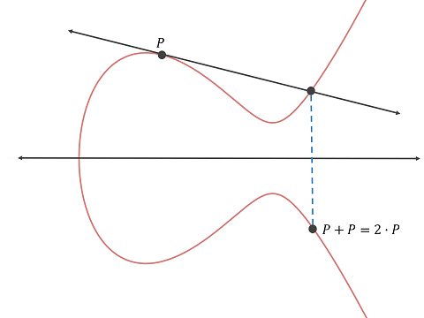

 # MI-PB-9
 **Eliptické křivky – projektivní rovina, eliptické křivky nad reálnými čísly a Galoisovými tělesy, MOV algoritmus.**

 ---

#### Eliptická křivka nad $\R$
Množina $E = \{(x,y): y^2 = x^3 + ax + b\} \cup \{O\}$, kde $a,b \in \R$, $O$ je **bod v nekonečnu** a platí, že $4a^3 + 27b^2 \neq 0$ 

**Sčítání bodů na $E$:** operace $\oplus$, kde $P \oplus Q, P=(p_1, p_2), Q=(q_1, q_2)$ je definovaná geometricky následovně:
* Pokud $p_1 \neq q_1$: $P \oplus Q$ je bod, který vznikne tak, že spojím přímkou $P$ a $Q$. Přímka prochází ještě jedním bodem křivky -- výsledný bod $P \oplus Q$ je jeho zrcadlovým obrazem podle osy $X$

* Pokud $p_1 = q_1$ a $P \neq Q$: $P \oplus Q = O$
* Pokud $p_1 = q_1$ a $P = Q$ a $p_1 = 0$: $P \oplus Q = O$
* Pokud $p_1 = q_1$ a $P = Q$ a $p_1 \neq 0$: $P \oplus Q$ je bod, který vznikne tak, že vedu tečnu na křivku v bodě $P(=Q)$. Tečna křivku protne v dalším bodě, jehož zrcadlový obraz podle osy $X$ je výsledkem

**Matematická interpretace $P\oplus Q$:**
* Pokud $P = O$: $P \oplus Q = Q$
* Pokud $Q = O$: $P \oplus Q = P$
* Pokud $P = (p_1, p_2), Q=(q_1, q_2), p_1 = q_1, p_2=-q_2$: $P\oplus Q = O$
* Pokud $P = (p_1, p_2), Q=(q_1, q_2): P \oplus Q = (r_1,r_2)$, 
kde
$r_1 = \lambda^2 - p_1 - q_1$
$r_2 = \lambda(p_1 - r_1) - p_2$
kde
$\lambda = \begin{cases} \frac{q_2-p_2}{q_1-p_1} & P \neq Q \\ \frac{3p_1^2 + a}{2p_2} & P = Q \end{cases}$

---

#### Projektivní rovina
$\mathbb P_2(\R)=  \{\left[ x \right]_{\sim} | x \in \R^3 \setminus \{(0,0,0)\} \}$
* **Relace $\sim$:** pro $x,y \in \R^3 \setminus \{(0,0,0)\}$ je $x \sim y \Leftrightarrow \exist \lambda \in \R$ t.ž. $\lambda x = y$
* Třída ekvivalence $\left[ x \right]_\sim = \{\lambda x | \lambda \neq 0\}$
* Značení: $x = (x_1, x_2, x_3)$, potom se třída ekvivalence značí $\left[ x \right]_\sim := (x_1 : x_2 : x_3)$ a říká se jí **projektivní bod**
Čísla $x_1, x_2, x_3$ jsou **homogenní souřadnice** tohoto bodu

Projektivní rovina obsahuje jak **afinní souřadnice** ($\in \R^2$) zapsané jako $(x_1, x_2)\rightarrow (x_1:x_2:1)$, tak body v nekonečnu: $(x_1, x_2) \rightarrow (x_1:x_2:0)$
 
**Homogenizace:** Převod afinních souřadnic na homogenní:
* $(x_1, x_2) \rightarrow (x_1:x_2:1) = (\lambda x_1, \lambda x_2, \lambda)$, což odpovídá nějakému $(X,Y,Z)$ a výsledkem homogenizace je $(\frac{X}{Z}:\frac{Y}{Z}:1)$

Křivká má **právě jeden bod v nekonečnu**
* Bod "mimo rovinu", mohou se v něm např. protnout 2 rovnoběžky
* Např: přímka $p_1:x+y+1 = 0$ má předpis v homogenních souřadnicích  $p_1: \frac{X}{Z}+\frac{Y}{Z}+1=0$, což po vynásobení $Z$ dá $p_1: X+Y+Z = 0$. Rovnoběžná přímka $p_2: X+Y+2Z = 0$. Po vyřešení soustavy rovnic dostaneme $\{\alpha, -\alpha,0| \alpha \in \R\}$, což odpovídá třídě ekvivalence $P = (1:-1:0) \in \mathbb P_2(\R)$, což je jejich průsečík, ale v "nekonečnu"

---

#### Eliptická křivka nad $GF(p^k)$
Eliptická křivka, jejíž body nejsou v $\R$, ale v $GF(p^n)$

**Hledání bodů na $E(GF(p^k))$:** zvolím $x \in E(GF(p^k))$, spočítám $t = x^3+ax+b$ a testuji, jestli $t$  je čtverec v $GF(p^k)$

**Diskrétní logaritmus na EC:** máme $P,Q \in E(GF(p^k))$, hledáme takové $n$, že $nP = Q$
Nejlepší algoritmus: $O(\sqrt{p^k})$

**Řád EC:** $\# E(GF(p^k)) \sim p^k + 1$
**Hasseho věta:** $p+1 -2\sqrt p \leq \# E(GF(p)) \leq p + 1 + 2\sqrt p$
**Výpočet řádu $E(GF(p))$:** obdoba Babystep-giantstep
* $P$ náhodný, $Q = (2s+1)P$, $R = (p+1)P$, kde $s \approx \sqrt[4]p$
* řada $P, 2P, ..., sP$
* řada $R \pm Q, R \pm 2Q, ..., R \pm tQ$, kde $t \approx \frac{2\sqrt p}{2s+1}$
* najít $i,j: R + iQ = jP$
* $m = p +1 +i(2s+1)-j$
* Pokud $m$ jediné, jde o řád
* Jinak zpět na krok 1

---

#### MOV algoritmus

**Množina $m$-torzních bodů:** $G$ grupa, množina všech prvků, jejichž řád je dělitelný $m$ (značení: $G[m]$).
V multiplikativní notaci: $G[m] = \{g \in G| g^m = 0\}$.
V aditivní notaci: $G[m] = \{g \in G| mg = 0\}$.
$G$ abelovská $\Rightarrow G[m]$ grupa

Platí: $K$ těleso.   $E(K)[m]$ je izomorfní $\Z_m^+ \times \Z_m^+$.
Na $E(K)[m]$ lze hledět jako na dvourozměrný vektorový prostor se skaláry v $\Z_m^+$ -- existují body $P,Q$ t.ž. libovolný bod lze vyjádřit jako jejich lineární kombinaci $\alpha_1P + \alpha_2 Q$

**Weilovo párování:**
$P,Q \in E[m]$, tj. $mP = mQ = O$
$f_P, f_Q$ racionární funkce na $E$.
Weilovo párování $P$ a $Q$:
$$
e_m(P,Q) = \frac{\frac{f_P(Q \oplus S)}{f_P(S)}}{\frac{f_Q(P \ominus S)}{f_Q(\ominus S)}}
$$
kde $S$ je bod $E$ ($S \notin \{O, P, \ominus Q, P \ominus Q\}$)

Weilovo párování **definuje zobrazení** 
$E(GF(p))[m] \times E(GF(p))[m] \rightarrow GF(p)^\times$

**Stupeň vnoření $E$ vzhledem k $m$:**
$E = E(GF(p^l)), m \in \N$ t.ž. $\gcd(m,p) = 1$ a $m$ dělí $\# E(GF(p^{l}))$.
Stupeň vnoření $E$ vzhledem k $m$ je nejmenší $k$ takové, že $E(GF(p^{lk}))[m]$ je izomorfní $\Z_m^+ \times \Z_m^+$
Ekvivalentní s nejmenším $k$ takovým, že $p^{lk} \equiv 1 \pmod m$

**MOV algoritmus:**
Převede ECDLP v $E(GF(p))$ na PDL v $GF(p^{k})^\times$ v polynomiálním čase. Lze rozšířit na převod ECDLP v $E(GF(p^l))$ na PDL v $GF(p^{lk})^\times$.

* **Předpoklady:**
$E = E(GF(p))$, $P,Q \in E$, 
$P$ je prvočíselného řádu $l >\sqrt{p}+1$ 
$Q$ je násobek $P$
$k$ je stupeň vnoření $E$ vzhledem k $l$
Umíme PDL v $GF(p^k)$

* Vypočti $N = \# E(GF(p^k))$ (pokud není $k$ velké, lze polynomiálně)
* Zvolit náhodně $T \in E(GF(p^k))$ tak, že $T \notin E(GF(p))$
* Vypočítat $T' = \frac{N}{l}T$. Pokud $T'=O$, zvolit jiné $T$
* Vypočítat Weilova párování:
$\alpha = e_l(P,T') \in GF(p^k)^\times$
$\beta = e_l(Q,T') \in GF(p^k)^\times$
*(lze efektivně $O(\log p^k)$)*
* Vyřešit PDL pro $\alpha, \beta$ v $GF(p^k)^\times$: nalézt $n$ splňující $\beta = \alpha^n$
* $\Rightarrow Q = nP$ 

Pokud $k$ malé, pak je křivka **kryptograficky slabá** a vyplatí se to (v $GF$ je PDL) efektivnější
* Pro bezpečnost chci $k > (\ln p)^2$