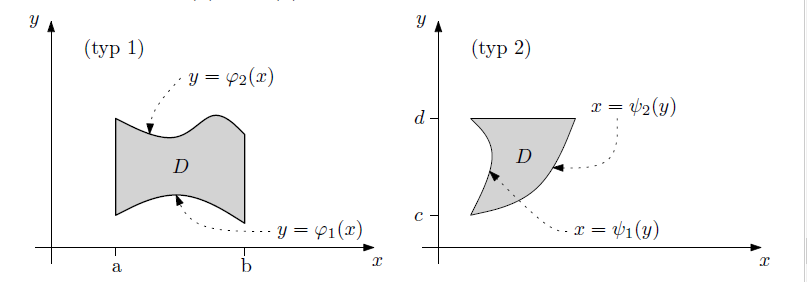

 # MI-SPOL-4	
 **Integrál funkcí více proměnných (Riemannova konstrukce).**

 ---

 Dán interval $[a,b]$. Konečná množina $\sigma = \{x_0, x_1, ..., x_n\}$ t.ž. $a = x_0 < x_1 < ... < x_n = b$ je **rozdělení intervalu $[a,b]$**. Body $x_k$ jsou dělící body.

 Číslo $\nu(\sigma) = \max\{\Delta_k: k = 1,2,...,n\}$, kde $\Delta_k = x_k = x_{k-1}$ je **norma rozdělení $\sigma$**.

 Nechť $f$ funkce definovaná na $[a,b]$ a $\sigma = \{x_0, x_1, ..., x_n\}$. 
 $$
 M_i = \max_{x \in [x_{i-1}, x_i]} f(x)
 $$
 $$
 m_i = \min_{x \in [x_{i-1}, x_i]} f(x)
 $$

 Potom 
 $$
 S_f(\sigma) = \sum_{i=1}^n M_i\Delta_i
 $$
a
$$
s_f(\sigma) = \sum_{i=1}^nm_i\Delta_i
$$
jsou **horní** a **dolní součet funkce $f$ při rozdělení $\sigma$**.

---

**Horní integrál funkce $f$ na $[a,b]$:** $D_f = \inf\{S_f(\sigma): \sigma$ je rozdlění na $[a,b]\}$

**Dolní integrál funkce $f$ na $[a,b]$:** $d_f = \sup\{s_f(\sigma): \sigma$ je rozdlění na $[a,b]\}$

Pokud $D_f = d_f$, je to **Darbouxův integrál** a značí se $\int_a^bf(x)dx = D_f = d_f $

Posloupnost rozdělní $\sigma_n$ je **normální**, pokud $lim_{n\rightarrow \infty} \nu(\sigma_n) = 0$

Pokud $f$ spojitá, pak existuje $\int_a^bf(x)dx$. Platí, že $\int_a^bf(x)dx = lim_{n\rightarrow \infty} s_f(\sigma_n) = lim_{n\rightarrow \infty} S_f(\sigma_n)$

**Aditivita a multiplikativita integrálu:** $f, g$ spojité na $[a,b]$ a $c \in \R$, potom 
$\int_a^b(f+g)(x)dx = \int_a^bf(x)dx + \int_a^bg(x)dx$
$\int_a^b(cf)(x)dx = c\int_a^bf(x)dx$

---

Funkce $f$ definovaná na $(a,b)$. Funkce $F$, kde $F' = f(x) \forall x \in (a,b)$ je **primitivní funkce** k $f$ v intervalu $(a,b)$

**Newtonova formule:** $f$ spojitá na $[a,b]$ s primitivní funkcí $F$. Potom platí: $\int_a^b f(x)dx=  F(b)-F(a) = \left[ F(x) \right]_a^b$

---

**Per Partes:** Nechť $f,g$ spojité na $[a,b]$, $f$ má spojitou derivaci na $[a,b]$ a $G$ je primitivní funkce $g$ na $[a,b]$. Potom
$$
\int_a^bf(x)g(x)dx = \left[ f(x)G(x) \right]_a^b - \int_a^bf'(x)G(x)dx
$$

**Substituce:** Pro funkce $f$ a $\varphi$ platí:
* $\varphi$ a $\varphi'$ jsou spojité na $[\alpha, \beta]$
* $f$ spojitá na $\varphi([\alpha, \beta])$

Potom: 
$$
\int_a^b f(\varphi(t))\cdot \varphi'(t)dt = \int_{\varphi(\alpha)}^{\varphi(\beta)} f(x)dx
$$

---

#### Dvě proměnné

$f: D \rightarrow\R$, kde $D = [a,b]\times [c,d]$

$\sigma_x = (x_i)_{i=0}^n$ rozdělení na $[a,b]$
$\sigma_y = (y_i)_{i=0}^m$ rozdělení na $[c,d]$
$\sigma = \sigma_x \times \sigma_y$ je rozdělení $D = [a,b]\times [c,d]$

$M_{i,j} = \max\{f(x,y): (x,y) \in [x_{i-1},x_i] \times [y_{j-1},y_j]\}$
$m_{i,j} = \min\{f(x,y): (x,y) \in [x_{i-1},x_i] \times [y_{j-1},y_j]\}$

**Horní Darbouxova suma $f$ vzhledem k rozdělení $\sigma$:**
$$
S_f(\sigma) = \sum_{i=1}^n \sum_{j=1}^m M_{i,j}(x_i-x_{i-1})(y_i-y_{i-1})
$$

**Dolní Darbouxova suma $f$ vzhledem k rozdělení $\sigma$:**
$$
s_f(\sigma) = \sum_{i=1}^n \sum_{j=1}^m s_{i,j}(x_i-x_{i-1})(y_i-y_{i-1})
$$

**Horní Darbouxův integrál:** $D_f = \inf\{S_f(\sigma): \sigma$ je obdélníkové rozdělení $D$\}$

**Dolní Darbouxův integrál:** $d_f = \sup\{s_f(\sigma): \sigma$ je obdélníkové rozdělení $D$\}$

Pokud $D_f = d_f$, jde o **dvojitý Darbouxův integrál** $f$ na $D$ a značí se $$\iint_D f(x,y)dxdy = D_f = d_f$$

---

Pokud $f(x,y)$ integrabilní na $D=[a,b]\times [c,d]$ a existuje jeden z integrálů 
$$ 
\int_a^b \left( \int_c^d f(x,y)dy \right) dx
$$
nebo
$$ 
\int_c^d \left( \int_a^b f(x,y)dx \right) dy
$$
Potom je roven 
$$
\iint_D f(x,y)dxdy
$$

---

#### Neobdélníková oblast 

* **typ 1:** $x \in [a,b]$, $y$ omezené spojitými funkcemi $\varphi_1(x), \varphi_2(x)$, kde $\varphi_1(x) \leq \varphi_2(x)$
$$
\iint_Df(x,y)dxdy = \int_a^b \left( \int_{\varphi_1(x)}^{\varphi_2(x)} f(x,y) dy \right) dx
$$

* **typ 2:** $y \in [c,d]$, $x$ omezené spojitými funkcemi $\psi_1(y), \psi_2(y)$, kde $\psi_1(y) \leq \psi_2(y)$ 
$$
\iint_Df(x,y)dxdy = \int_c^d \left( \int_{\psi_1(x)}^{\psi_2(x)} f(x,y) dx \right) dy
$$

---

Užití dvojného integrálu:
* průměr: $\left(\iint_D f(x,y)dxdy\right) / \left(\iint_D 1 dxdy\right)$
* těžiště desky
* povrch grafu
